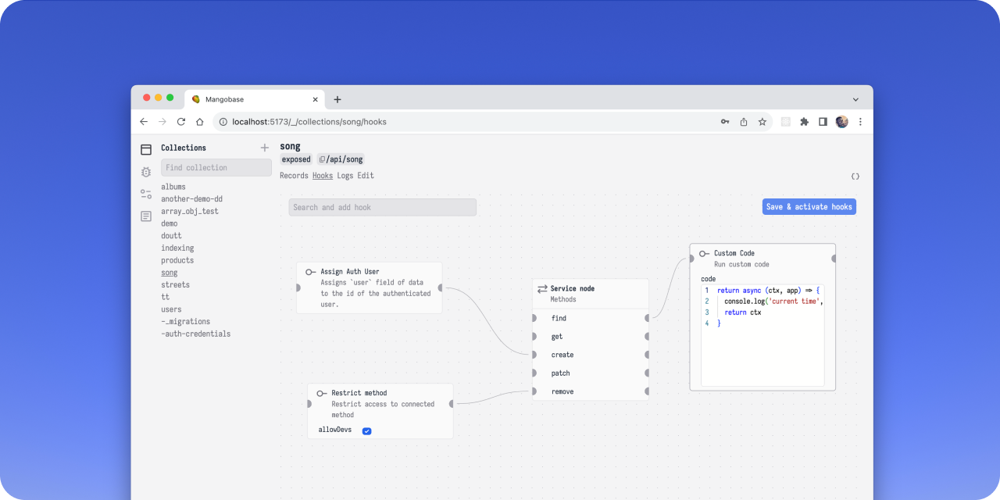

# mangobase

[](https://www.npmjs.com/package/mangobase)
[](https://www.npmjs.com/package/mangobase)
[](https://www.npmjs.com/package/mangobase)

Low-code Javascript backend framework for Node and Bun runtimes. Docs [here](https://degreat.co.uk/mangobase).

```sh
npm create mango@latest
```

<p align="center">
  <picture>
  <source width="830" media="(prefers-color-scheme: dark)" srcset="assets/ss-dark.png">
			<source width="830" media="(prefers-color-scheme: light)" srcset="assets/ss-light.png">
			
  </picture>
</p>

See [Contributing](CONTRIBUTING.md) for development guide on how contribute.