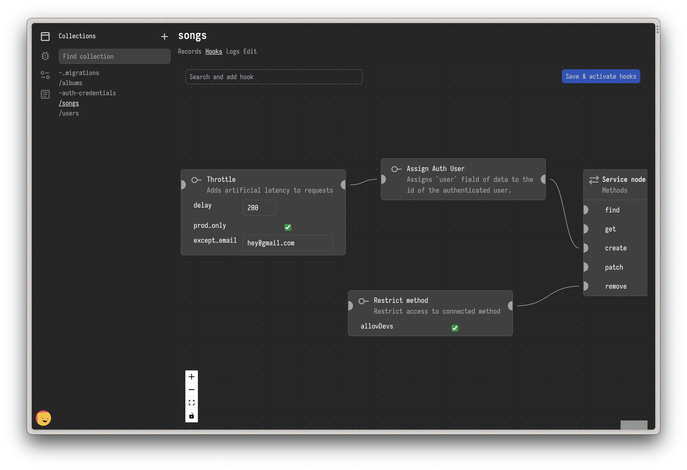

# mangobase

[](https://www.npmjs.com/package/mangobase)
[](https://www.npmjs.com/package/mangobase)
[](https://www.npmjs.com/package/mangobase)

Low-code Javascript backend framework for Node and Bun runtimes. Docs [here](https://degreat.co.uk/mangobase).

```sh
npm create mango@latest
```



## Development

This is a monorepo. Run `yarn install && yarn build` to install all dependencies.

### Design summary

The `base` package contains the core of the project. In there, you'll find code related to dealing with collections, plugins, handling requests (aka contexts), etc.

You'll need to interface with the base using a server. So there are two implementations: `@mangobase/express` and `@mangobase/bun`. You'll also need to provide a database but we have an implementation: `@mangobase/mongodb`.

### Contributions

It's recommended to create a separate branch for your contributions. First, fork this project then make your changes. Submit a PR when you think its ready to be merged.

See: https://docs.github.com/en/get-started/quickstart/contributing-to-projects

#### base

When contributing to the `base`, you many need to test your implementation using unit tests/specs.

To actually validate your code, run `yarn build:base && yarn copy-admin`. You can then use one of the example projects to test your code. Do `yarn dev:express-mongo` or `bun dev:bun-mongo`

> You should have [bun](https://bun.sh) installed to try the bun example.

You can then use an HTTP client to test endpoints.

Another way to validate your addition is to use the admin/dev dashboard.

### admin

The [dev] admin panel is where the low-code experience happens. It's developed with Vite/Preact.

Run it with `yarn dev:admin`. You need to have a server running. Run one with `yarn dev:express-mongo`
